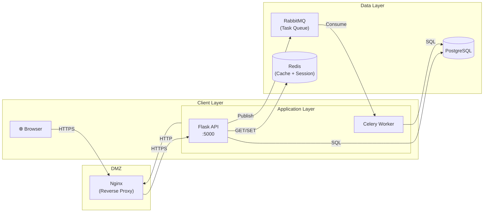
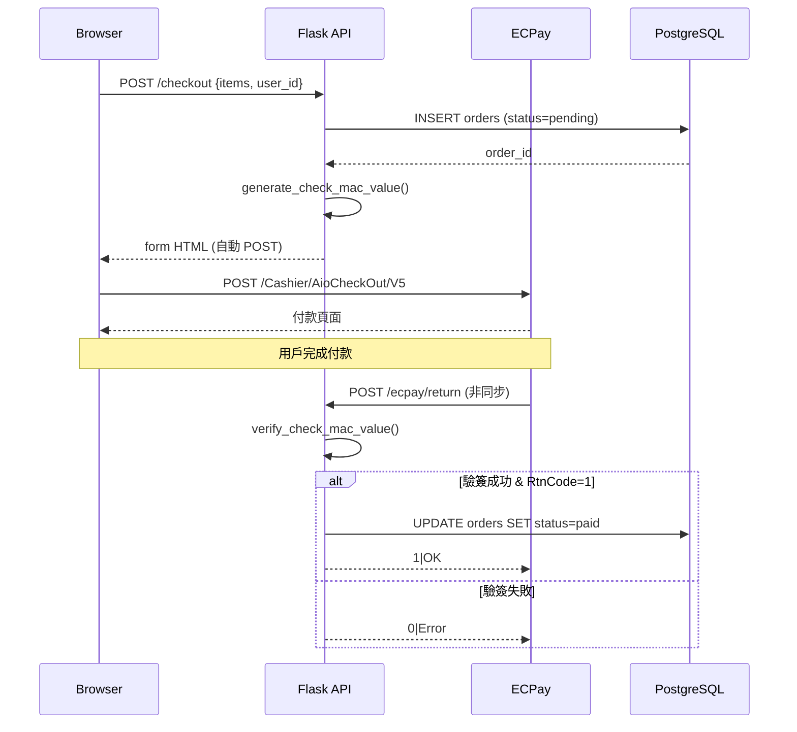
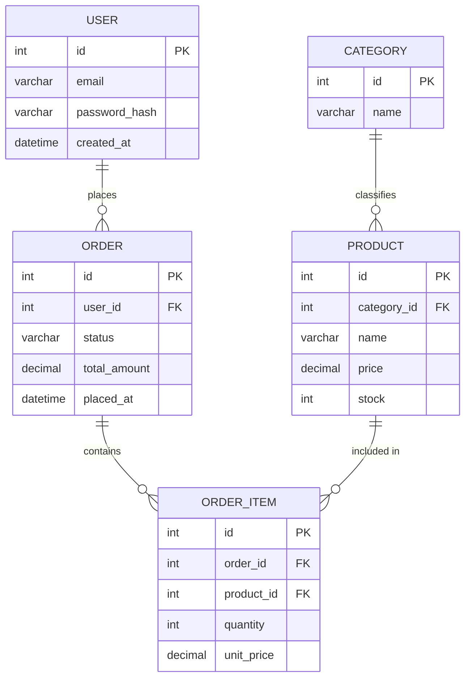
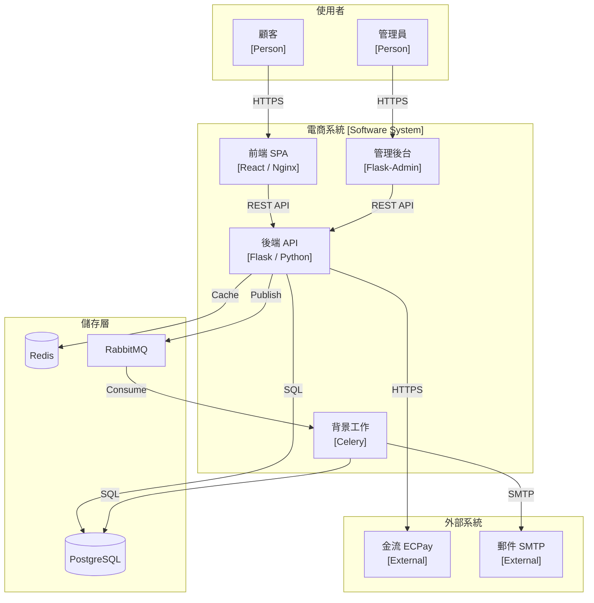
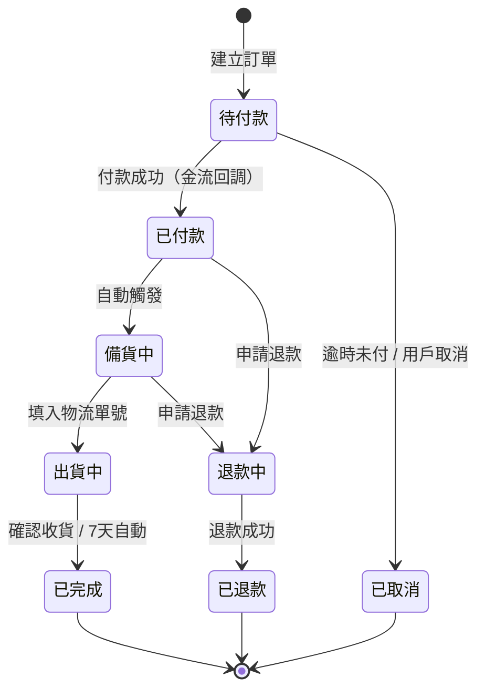

# AI 輔助設計文件與架構圖

```
使用 AI（Claude / GPT / Gemini）產生 Web 應用與後端服務的設計文件、架構圖
文件格式：Mermaid、PlantUML、OpenAPI YAML、Markdown
適用階段：需求分析、系統設計、API 設計、資料庫設計、技術決策記錄
```

## 目錄

- [AI 輔助設計文件與架構圖](#ai-輔助設計文件與架構圖)
  - [目錄](#目錄)
  - [參考資料](#參考資料)
- [適用情境](#適用情境)
- [設計文件類型](#設計文件類型)
- [架構圖工具比較](#架構圖工具比較)
- [Prompt 範本](#prompt-範本)
  - [系統架構圖](#系統架構圖)
  - [API 設計文件](#api-設計文件)
  - [資料庫 ERD](#資料庫-erd)
  - [循序圖（Sequence Diagram）](#循序圖sequence-diagram)
  - [技術決策記錄（ADR）](#技術決策記錄adr)
  - [Tech Spec / RFC](#tech-spec--rfc)
- [Mermaid 語法範例](#mermaid-語法範例)
  - [系統架構圖（flowchart）](#系統架構圖flowchart)
  - [循序圖](#循序圖)
  - [ERD](#erd)
  - [C4 架構圖（容器層）](#c4-架構圖容器層)
  - [狀態機圖](#狀態機圖)
- [工作流程建議](#工作流程建議)
- [實際範例：電商後端服務](#實際範例電商後端服務)

## 參考資料

[Mermaid 官方文件](https://mermaid.js.org/)

[PlantUML 官方文件](https://plantuml.com/)

[C4 Model（架構圖標準）](https://c4model.com/)

[OpenAPI Specification 3.x](https://swagger.io/specification/)

[Architecture Decision Records（ADR）](https://adr.github.io/)

---

# 適用情境

| 情境 | AI 能做什麼 | 輸出格式 |
|---|---|---|
| 新專案設計 | 根據需求描述生成完整系統架構圖 | Mermaid flowchart / C4 |
| API 設計 | 根據功能描述生成 OpenAPI YAML | YAML |
| 資料庫設計 | 根據業務規則生成 ER Diagram | Mermaid erDiagram |
| 流程說明 | 根據程式碼生成循序圖 | Mermaid sequenceDiagram |
| 技術選型 | 生成 ADR 文件草稿，列出方案比較 | Markdown |
| 既有系統文件化 | 貼入程式碼，AI 反推架構圖 | Mermaid / PlantUML |
| Code Review 前置 | 生成變更影響範圍圖 | Mermaid |

---

# 設計文件類型

| 文件 | 縮寫 | 說明 | 適合 AI 生成程度 |
|---|---|---|---|
| 系統設計文件 | SDD | 整體架構、模組分工、資料流 | ★★★★★ |
| 技術規格書 | Tech Spec | 功能實作細節、介面定義 | ★★★★☆ |
| API 設計文件 | OpenAPI | RESTful 端點、Request/Response 格式 | ★★★★★ |
| 資料庫設計 | ERD | 資料表關聯、欄位定義 | ★★★★★ |
| 技術決策記錄 | ADR | 為何選用某技術方案的決策過程 | ★★★★☆ |
| 循序圖 | Sequence | 模組間的呼叫順序與訊息流 | ★★★★★ |
| 變更需求說明 | RFC | 重大功能變更的提案文件 | ★★★☆☆ |

---

# 架構圖工具比較

| 工具 | AI 友善度 | 說明 |
|---|---|---|
| **Mermaid** | ★★★★★ | 純文字語法，AI 直接輸出可在 GitHub / VSCode / Notion 渲染 |
| **PlantUML** | ★★★★☆ | 文字語法，圖形較正式，適合 UML 標準場景 |
| **OpenAPI YAML** | ★★★★★ | AI 生成後可直接匯入 Swagger UI / Postman |
| **draw.io XML** | ★★★☆☆ | AI 可生成 XML，但語法複雜，通常需手動調整 |
| **Excalidraw** | ★★☆☆☆ | 手繪風格，AI 不易精確控制佈局 |
| **C4 + Mermaid** | ★★★★★ | C4 語意層次 + Mermaid 語法，最適合後端架構文件 |

---

# Prompt 範本

## 系統架構圖

```
你是一位後端架構師。根據以下需求，使用 Mermaid flowchart LR 語法生成系統架構圖。

需求：
- [描述你的系統，例如：多租戶 SaaS 電商平台，支援 Web + App]
- 主要元件：[前端 / API Gateway / 微服務 / 資料庫 / Cache / MQ]
- 使用技術：[Flask / PostgreSQL / Redis / RabbitMQ / Nginx]

要求：
1. 包含所有主要元件和流量方向
2. 標示通訊協定（HTTP / WebSocket / AMQP）
3. 區分不同環境（Client / DMZ / Internal / Data Layer）
4. 輸出純 Mermaid 程式碼，不需要額外說明
```

## API 設計文件

```
你是一位 API 設計師。根據以下功能描述，生成符合 RESTful 規範的 OpenAPI 3.0 YAML。

功能描述：
- [例如：用戶管理模組，包含註冊、登入、個人資料更新、刪除帳號]
- 認證方式：[JWT Bearer Token]
- 回傳格式：統一使用 { "code": 200, "data": {...}, "msg": "success" }

要求：
1. 包含 paths、components/schemas、components/securitySchemes
2. 每個端點需有 summary、parameters、requestBody、responses
3. 包含常見錯誤碼（400 / 401 / 404 / 422 / 500）
4. 輸出完整 YAML
```

## 資料庫 ERD

```
你是一位資料庫設計師。根據以下業務規則，使用 Mermaid erDiagram 語法生成 ER Diagram。

業務規則：
- [例如：電商系統，一個用戶可以有多筆訂單，一筆訂單包含多個訂單明細]
- [一個商品屬於一個分類，可以有多張圖片]
- [訂單有狀態流轉：待付款 → 已付款 → 出貨中 → 已完成]

要求：
1. 標示主鍵（PK）、外鍵（FK）
2. 標示欄位資料型別（int / varchar / datetime / decimal）
3. 標示關聯基數（one-to-many / many-to-many）
4. 輸出純 Mermaid 程式碼
```

## 循序圖（Sequence Diagram）

```
你是一位後端工程師。根據以下流程描述，使用 Mermaid sequenceDiagram 語法生成循序圖。

流程描述：
- [例如：用戶使用信用卡付款的完整流程，從前端送出到金流回調]
- 涉及角色：[Browser / Frontend / Backend API / Payment Gateway / Database / Redis]

要求：
1. 標示同步呼叫（->>）與非同步回調（-->>）
2. 包含成功與失敗分支（alt / else）
3. 標示關鍵步驟的資料內容（如 JWT token、訂單編號）
4. 輸出純 Mermaid 程式碼
```

## 技術決策記錄（ADR）

```
你是一位技術架構師。根據以下背景，生成一份 ADR（Architecture Decision Record）文件。

決策主題：[例如：選擇訊息佇列方案]
背景：[目前系統架構、遇到的問題]
評估方案：[RabbitMQ / Kafka / Redis Pub/Sub / AWS SQS]
決策結果：[最終選擇與原因]
約束條件：[團隊規模、預算、現有技術棧]

輸出格式（Markdown）：
# ADR-{編號}: {標題}
## 狀態
## 背景
## 決策
## 方案比較
## 後果（優點與缺點）
## 參考資料
```

## Tech Spec / RFC

```
你是一位後端工程師。根據以下功能描述，生成一份 Tech Spec 文件草稿。

功能名稱：[例如：用戶行為事件追蹤系統]
背景與動機：[為什麼需要這個功能]
範圍：[哪些功能包含在內、哪些不包含]
技術方案：[主要實作方式]
使用技術：[Python / Kafka / ClickHouse]

輸出格式（Markdown）：
# Tech Spec: {功能名稱}
## 概述
## 動機與背景
## 設計目標
## 非目標（Out of Scope）
## 系統設計
## API / 介面定義
## 資料模型
## 風險與未解決問題
## 里程碑
```

---

# Mermaid 語法範例

## 系統架構圖（flowchart）



## 循序圖



## ERD



## C4 架構圖（容器層）



## 狀態機圖



---

# 工作流程建議

```
1. 需求澄清
   └─ 用自然語言描述功能給 AI，請 AI 提問直到需求明確

2. 架構草稿
   └─ 用「系統架構圖 Prompt」生成 Mermaid flowchart
   └─ 確認元件、流量方向、技術棧後，複製進文件

3. 資料庫設計
   └─ 用「ERD Prompt」生成 Mermaid erDiagram
   └─ 校驗關聯基數、欄位型別後納入設計文件

4. API 定義
   └─ 用「OpenAPI Prompt」生成 YAML
   └─ 匯入 Swagger UI / Postman 驗證格式

5. 流程細化
   └─ 針對複雜業務流程（付款 / 通知 / 補償機制），用「循序圖 Prompt」生成

6. 決策記錄
   └─ 重要技術選型產出 ADR，存入 docs/adr/ 目錄

7. 文件化（既有系統）
   └─ 貼入關鍵程式碼片段，請 AI 反推架構圖與循序圖
```

---

# 實際範例：電商後端服務

## Step 1 — 描述需求給 AI

```
系統名稱：多店家 B2C 電商平台
技術棧：Python Flask + PostgreSQL + Redis + RabbitMQ + Nginx
主要功能：商品管理、購物車、訂單（整合 ECPay）、電子發票、推播通知
部署環境：單台 VM，Docker Compose
```

## Step 2 — AI 輸出系統架構圖（Mermaid）

> 參考上方「系統架構圖（flowchart）」範例。

## Step 3 — AI 輸出訂單付款循序圖

> 參考上方「循序圖」範例。

## Step 4 — AI 輸出資料庫 ERD

> 參考上方「ERD」範例。

## Step 5 — AI 輸出訂單狀態機

> 參考上方「狀態機圖」範例。

## Step 6 — 整合進設計文件

```markdown
# 系統設計文件 v1.0

## 1. 系統架構
[貼入 Mermaid flowchart]

## 2. 資料庫設計
[貼入 Mermaid erDiagram]

## 3. 訂單流程
[貼入 Mermaid sequenceDiagram]

## 4. 狀態機
[貼入 Mermaid stateDiagram]

## 5. API 文件
[連結至 Swagger UI 或貼入 OpenAPI YAML]
```

> **Mermaid 渲染支援：** GitHub Markdown、GitLab、Notion、Obsidian、VSCode（需 Mermaid 外掛）、MkDocs
